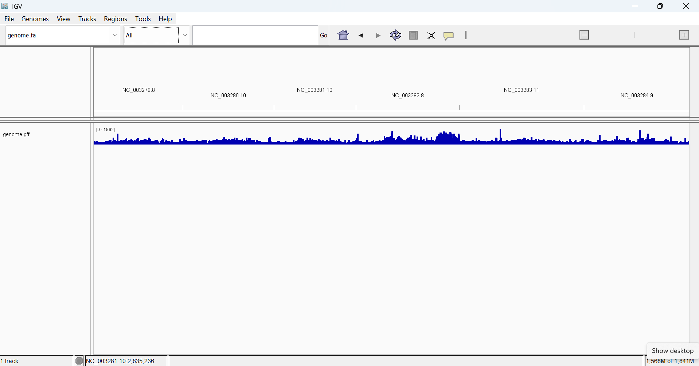
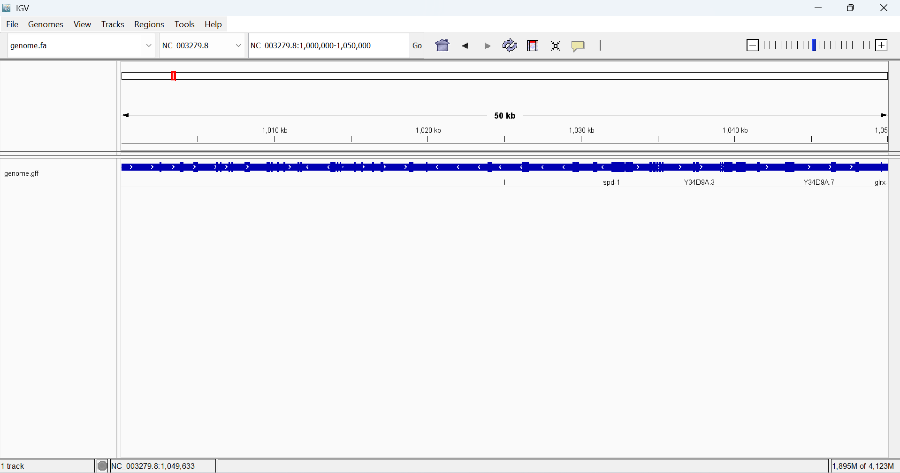
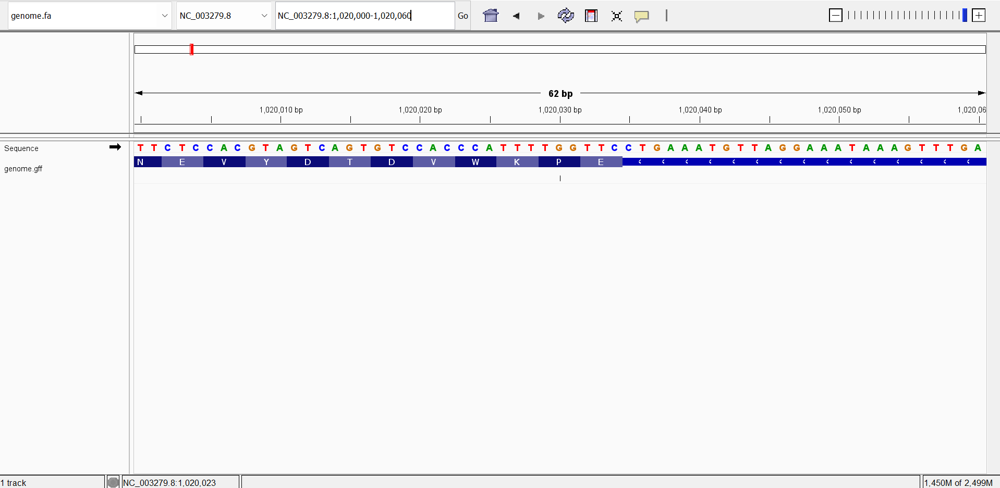
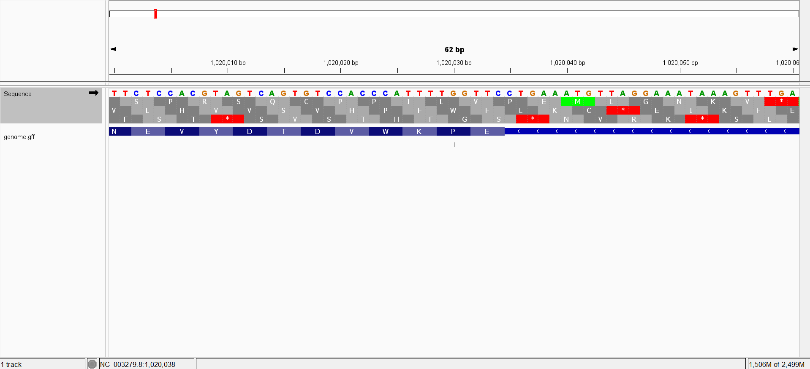
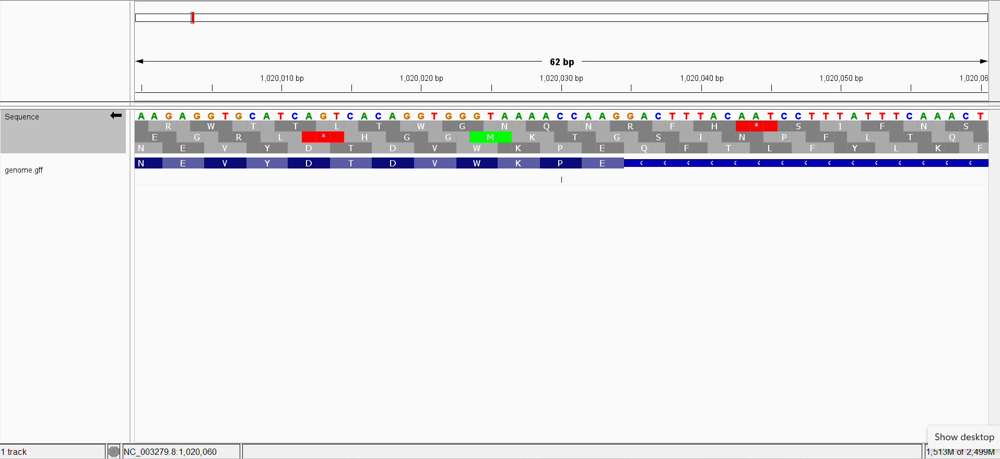
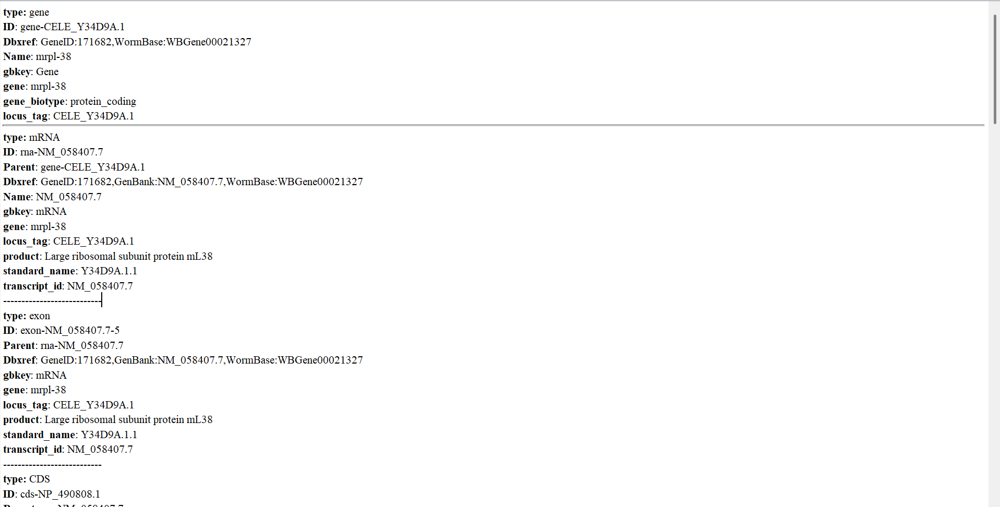
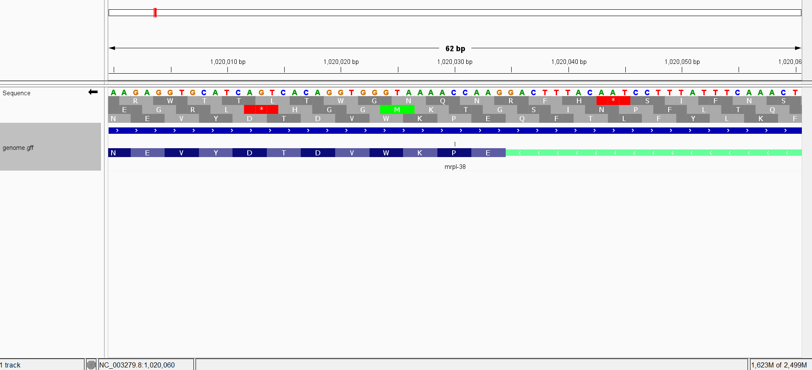

# Week 02 — Obtain and Visualize Genomic Data

**Author:** Shraman Jana
**Organism:** *Caenorhabditis elegans* (nematode)
**Assembly:** GCF_000002985.6 (WBcel235), RefSeq — [NCBI record](https://www.ncbi.nlm.nih.gov/datasets/genome/GCF_000002985.6/)

*C. elegans* is the foundational model organism in the biology of aging: the
insulin/IGF-1 signaling pathway and the longevity genes *daf-2* and *daf-16*, as
well as the genetics of dietary-restriction lifespan extension, were first worked
out in this worm. It is not a genome used in the course book or lectures, it is
fully sequenced and richly annotated, and at ~100 Mb across six chromosomes it is
small enough to download and inspect quickly while still being a true eukaryote.

---

## Part 1 — Download the data

### Files

```
week02/
├── Makefile        # downloads + decompresses the data and reports statistics
├── README.md       # this file
└── refs/           # created by `make download`; holds the genome + annotation
    ├── genome.fa   # FASTA sequence
    └── genome.gff  # GFF3 annotation
```

The data is kept in a dedicated `refs/` directory rather than the working
directory, so nothing is dumped loose.

### How to run the Makefile

From inside the `week02` directory, in the `bioinfo` environment:

```bash
micromamba activate bioinfo

make            # shows the list of available commands
make download   # downloads and decompresses the FASTA + GFF into refs/
make stats      # prints genome size, sequence count, and annotation counts
make clean      # deletes refs/ so you can start fresh
```

To use a **different genome**, change only the `ACC` and `URL` lines at the top of
the Makefile — everything else is generic.

---

## Answers to the questions

```
# Genome size (bp):
100286401
# Number of sequences (chromosomes / replicons):
7
# Sequence names:
>NC_003279.8 Caenorhabditis elegans chromosome I
>NC_003280.10 Caenorhabditis elegans chromosome II
>NC_003281.10 Caenorhabditis elegans chromosome III
>NC_003282.8 Caenorhabditis elegans chromosome IV
>NC_003283.11 Caenorhabditis elegans chromosome V
>NC_003284.9 Caenorhabditis elegans chromosome X
>NC_001328.1 Caenorhabditis elegans mitochondrion, complete genome
# Total annotation lines in GFF (excluding comments):
547615
# Feature types and their counts:
 239332 exon
 204604 CDS
  44795 gene
  30562 mRNA
  15363 piRNA
   7779 ncRNA
   2131 pseudogene
    658 transcript
    634 tRNA
    458 miRNA
    346 snoRNA
    276 primary_transcript
    209 pseudogenic_tRNA
    202 lncRNA
    129 snRNA
    104 antisense_RNA
     22 rRNA
      7 region
      2 sequence_feature
      1 scRNA
      1 pseudogenic_rRNA
# Number of genes:
44795
```

**How large is the genome? How many chromosomes does it have?**

The genome is about **100 Mb** (~100,286,401 bp). *C. elegans* has **six
chromosomes** — five autosomes (I–V) and one sex chromosome (X). Note the FASTA
contains **seven** sequences, because it also includes the small mitochondrial
genome (MtDNA); that is an organellar genome, not a nuclear chromosome, so the
chromosome count is six.

**How many annotations are in the annotation file?**

The GFF3 file contains 547,615 annotation lines across 21 feature types. The most abundant are exon (239,332), CDS (204,604), and gene (44,795). The gene count (44,795) is much higher than the ~20,000 protein-coding genes because RefSeq annotates many non-coding gene types too — notably 15,363 piRNAs, plus ncRNAs, tRNAs, and pseudogenes.

**How complete is this genomic build, in your opinion?**

In my opinion this is a highly complete, mature genome build. WBcel235 is a chromosome-level reference where each of the six chromosomes is a single continuous sequence with no scaffolding gaps, and it also includes the full mitochondrial genome. The annotation depth - over half a million features covering protein-coding genes, non-coding RNAs, and pseudogenes reflects that maturity rather than a rough first draft. As I am currently involved in aging biology research, I find this especially valuable as so much of what we know about the genetics of lifespan (insulin/IGF-1 signaling, daf-2/daf-16) rests on this worm, and reliable longevity research depends on exactly this kind of trustworthy, richly annotated reference.

---

## Part 2 — Visualize the genome in IGV

The FASTA (`refs/genome.fa`) was loaded as the genome and the GFF
(`refs/genome.gff`) as an annotation track in IGV.



**How tightly packed are the genes in this genome? Estimate the gene-to-gene distance via the browser.**

Genes are tightly packed. If we divide the genome size (~100.3 Mb) by the number of gene features (44,795), it gives an average of one gene roughly every ~2.2 kb. IGV also agrees visually: a 50 kb window on chromosome I holds ~20 genes with only small intergenic gaps, and genes appear on both strands. This compact spacing is characteristic of the *C. elegans* genome.



**Pick a coordinate on the chromosome and visually inspect the sequence regions around it.**

I inspected chromosome I (NC_003279.8) around coordinate 1,020,030. At this zoom, IGV displays the individual bases (A/C/G/T) and their translation.



**Describe all six reading frames (codons) that the coordinate could be part of.**

A single genomic position can be read in six reading frames: three on the forward strand (offsets +1, +2, +3) and three on the reverse-complement strand (−1, −2, −3). In IGV, each frame produces a different string of amino acids; start codons (ATG → M) are shown in green and stop codons in red. The forward frames are shown first, then the reverse strand (done by flipping the sequence-track strand arrow).





**Identify the type of feature displayed as a data track.**

The genome.gff track displays gene annotation features organized hierarchically — a gene, its mRNA transcript, and the constituent exon and CDS features, along with a chromosome-level region feature. Clicking the gene *mrpl-38* shows:

```
type: gene
ID: gene-CELE_Y34D9A.1
Dbxref: GeneID:171682,WormBase:WBGene00021327
Name: mrpl-38
gbkey: Gene
gene: mrpl-38
gene_biotype: protein_coding
locus_tag: CELE_Y34D9A.1

type: mRNA
ID: rna-NM_058407.7
Parent: gene-CELE_Y34D9A.1
Dbxref: GeneID:171682,GenBank:NM_058407.7,WormBase:WBGene00021327
Name: NM_058407.7
gbkey: mRNA
gene: mrpl-38
locus_tag: CELE_Y34D9A.1
product: Large ribosomal subunit protein mL38
standard_name: Y34D9A.1.1
transcript_id: NM_058407.7

type: exon
ID: exon-NM_058407.7-5
Parent: rna-NM_058407.7
Dbxref: GeneID:171682,GenBank:NM_058407.7,WormBase:WBGene00021327
gbkey: mRNA
gene: mrpl-38
locus_tag: CELE_Y34D9A.1
product: Large ribosomal subunit protein mL38
standard_name: Y34D9A.1.1
transcript_id: NM_058407.7

type: CDS
ID: cds-NP_490808.1
Parent: rna-NM_058407.7
Dbxref: GeneID:171682,GenBank:NP_490808.1,WormBase:WBGene00021327
Name: NP_490808.1
Note: Confirmed by transcript evidence
gbkey: CDS
gene: mrpl-38
locus_tag: CELE_Y34D9A.1
product: Large ribosomal subunit protein mL38
protein_id: NP_490808.1
standard_name: Y34D9A.1

type: region
ID: NC_003279.8:1..15072434
Dbxref: taxon:6239
Name: I
chromosome: I
gbkey: Src
genome: chromosome
mol_type: genomic DNA
strain: Bristol N2
```



**Color features by their strand orientation.**

I used the track's strand options ("Change Track Color (Negative Values or Strand)" and "Group by strand"). Features are separated and colored by direction of mRNA transcription. Plus-strand and minus-strand genes are shown distinctly.




