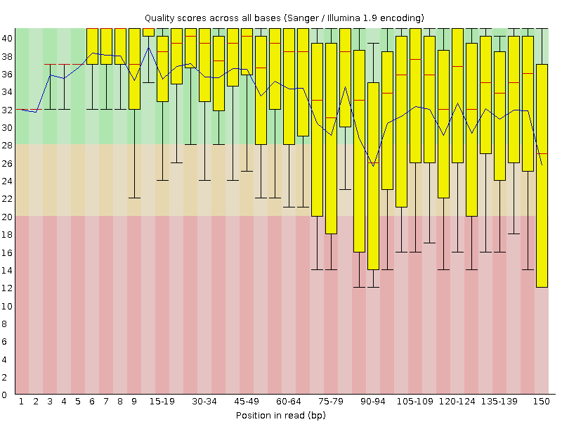
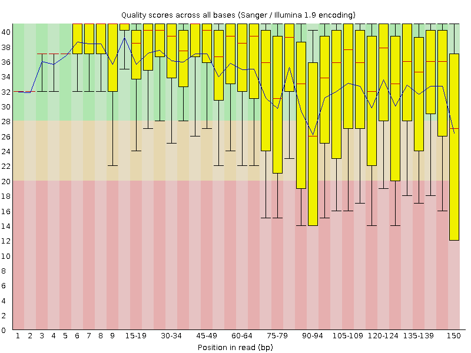
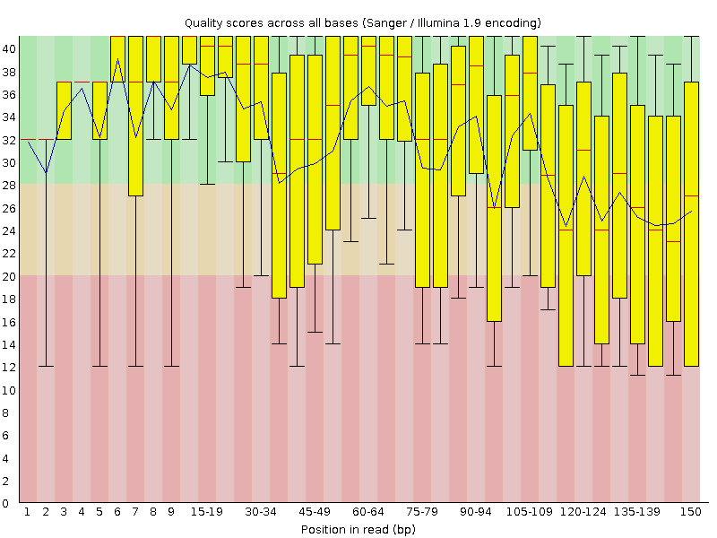

# Week 04: Download and QC FASTQ Data from the SRA

**Author:** Shraman Jana

**Organism:** *Caenorhabditis elegans* (the genome I chose in [Week 02](../week02/README.md))

**Assembly context:** WBcel235 (GCF_000002985.6)

This week I assessed how much public sequencing data exists for *C. elegans* in the SRA, then built a Makefile that downloads a subset of reads for one experiment, runs quality control, trims the reads, and re-runs QC to see whether trimming made a difference.

---

## Part 1 - Experimental evidence for the genome

### 1. How popular is this genome? How many datasets are available?

*C. elegans* is one of the most heavily sequenced model organisms. As a concrete measure, a 2024 study that remapped every *C. elegans* transcriptome in the SRA reported **11,533 transcriptome datasets (~240 TB)** deposited between 2009 and 2023 - and those are only transcriptomes alone, without counting genomic, epigenomic, or other library types.

Totals were obtained from the SRA and ENA browsers:

- **SRA:** search [`txid6239[Organism]`](https://www.ncbi.nlm.nih.gov/sra/?term=txid6239%5BOrganism%5D)
  and read the result count.
- **ENA:** browse taxon [6239](https://www.ebi.ac.uk/ena/browser/text-search?query=6239)
  and look at the read/run totals.

> Current total for taxid 6239 (from my SRA search `txid6239[Organism]`):
> **75,805 experiments** (75,797 public), spanning **2,473 BioProjects** and
> **70,528 BioSamples**.

### 2. Breakdown by sequencing strategy and platform

The facet counts below were read from the **Filters** sidebar in SRA (Source,
Library layout, Platform, Strategy):

| Attribute | Category | Count |
|-----------|----------|-------|
| Source | DNA | 32,540 |
| | RNA | 42,043 |
| Library layout | Paired | 42,808 |
| | Single | 32,997 |
| Platform | Illumina | 69,070 |
| | Ion Torrent | 3,563 |
| | BGISEQ | 1,688 |
| | Oxford Nanopore | 299 |
| | PacBio SMRT | 258 |
| | ABI SOLiD | 236 |
| Strategy | Genome | 20,739 |
| | Exome | 2,095 |
| | EpiGenomics | 626 |
| | RNASeq (tagged) | 717 |
| | Other | 51,628 |

*Counts read from the SRA Filters sidebar for `txid6239[Organism]` on 2026-09-19.*

The archive is overwhelmingly **Illumina** - 69,070 of 75,805 experiments (~91%) - while long-read platforms are still a minor fraction (PacBio SMRT 258, Oxford Nanopore 299, i.e. under 1% combined). By source, RNA (42,043) slightly outnumbers DNA (32,540), and paired-end (42,808) slightly outnumbers single-end (32,997). Note that the "Strategy" facet is inconsistently applied: only 717
experiments carry the explicit "RNASeq" tag even though 42,043 are RNA by source, so most transcriptomic runs fall into the catch-all "other" bucket (51,628) rather than under a clean strategy label.

### 3. What I find interesting or surprising

I found two things interesting. First, the **scale**: over 75,000 experiments for a 100 Mb genome shows that *C. elegans* is used less to establish its reference and more as a platform for perturbation experiments (mutants, diets, stresses, aging time-courses). Second, and more surprising, is how **inconsistent the metadata is**: only 717 experiments are tagged "RNASeq," yet 42,043 are RNA by
source - so the vast majority of transcriptomic runs sit in the unlabeled "other" bucket. So, filtering the SRA on a single field can badly undercount what is actually available. I also found it striking that, even for a classic long-established model organism, long-read data (~557 runs) is well under 1% of the archive - short-read Illumina still dominates completely.

---

## Part 2 — Download and QC an experiment

### Data used

| Field | Value |
|-------|-------|
| Accession | `SRR8240860` |
| Study | *C. elegans* RNA-Seq (BioProject SRP170618) |
| Platform | Illumina HiSeq X Ten |
| Layout | Paired-end |
| Reads downloaded | first `N = 10000` (a subset, not the full run) |

### How to run

In the `bioinfo` environment, from this `week04` directory:

```bash
micromamba activate bioinfo

make            # list the available commands
make all        # download -> FastQC(raw) -> fastp trim -> FastQC(trimmed)
```

The pipeline is parameterized - you can point it at any run without editing the file:

```bash
make all SRR=SRR8435655 SAMPLE=celegans_single N=20000
```

Because `fastq-dump` handles the download uniformly, changing only the accession lets it pull reads from different studies/platforms (the recipe assumes paired-end; for a single-end run, drop the R2 arguments in the `trim` recipe).

### What the Makefile does

- **download** — `fastq-dump -X N --split-files` fetches the first `N` reads of
  the accession into `reads/`, then renames the `SRR..._1/_2` files to the
  descriptive `$(SAMPLE)_R1/_R2` names.
- **fastqc** — runs FastQC on the raw reads, writing an HTML report to `qc/raw/`.
- **trim** — runs `fastp` (quality/adapter trimming) into `trimmed/`, with its
  own report at `qc/fastp.html`.
- **fastqc-trim** — runs FastQC on the trimmed reads into `qc/trimmed/`.

Outputs are organized into directories named by data type: `reads/`, `trimmed/`, and `qc/`.

### Did the QC step make a difference?

Yes - trimming made a measurable difference. Comparing the raw reads with the `fastp`-filtered reads (10,000 read pairs downloaded):

| Metric | Raw | After fastp |
|--------|-----|-------------|
| Read pairs | 10,000 | 9,055 (1,890 reads dropped for low quality) |
| R1 total bases | 1,500,000 | 1,353,369 |
| R1 Q30 | 72.68% | 75.05% |
| R2 Q30 | 62.14% | 65.60% |
| R1 Q20 | 86.48% | 87.94% |
| R2 Q20 | 79.69% | 82.17% |
| Reads with adapter trimmed | - | 230 (9,798 adapter bases removed) |
| Duplication rate | - | 0.29% |
| Insert-size peak | - | 264 bp |

**What changed:**

- **Per-base quality improved.** After removing low-quality reads and trimming
  poor-quality tails, Q30 rose by ~2-3 percentage points in both reads, so the
  retained data is cleaner.
- **Low-quality reads were removed.** 1,890 of 20,000 reads (~9.5%) failed the
  quality filter and were dropped; no reads failed for excess Ns or for being
  too short.
- **A small amount of adapter contamination was removed** (230 reads, ~9.8 kb of
  adapter bases).
- **Read 2 is consistently lower quality than Read 1** (e.g. Q20 79.7% vs 86.5%
  before trimming). This is the expected paired-end pattern where the second read
  degrades more, and it is exactly the kind of issue QC is meant to surface.

**Conclusion:** the QC/trim step made a visible, worthwhile difference - it discarded ~9.5% of low-quality reads and lifted the per-base quality of what remained, at the cost of a modest reduction in total data. For a downstream application like alignment or expression quantification, the trimmed set is the better input.

### QC visualizations (FastQC per-base quality)

Read 1 - raw vs. trimmed:

| Raw | Trimmed |
|-----|---------|
|  |  |

Read 2 - raw vs. trimmed:

| Raw | Trimmed |
|-----|---------|
|  |  |

In the FastQC per-base quality plots, the boxes shift up (and the lower whiskers
lift out of the orange/red zones) after trimming, and Read 2 - which starts
lower-quality than Read 1 - shows the clearest improvement. The full FastQC and
fastp HTML reports are regenerated in `qc/raw/`, `qc/trimmed/`, and
`qc/fastp.html` by `make all`.

---

## Reproducing this analysis

```bash
git clone https://github.com/shraman2000/bmmb852.git
cd bmmb852/week04
micromamba activate bioinfo
make all
```

Generated data (`reads/`, `trimmed/`, `qc/`) is not committed - it is regenerated
by `make all`.
