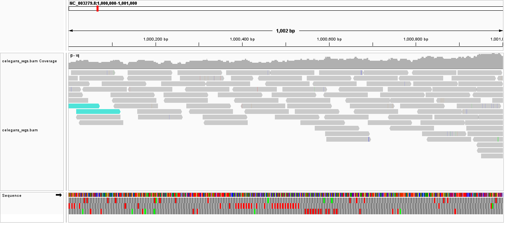

# Week 05: Align Reads and Generate a BAM File

**Author:** Shraman Jana

**Organism / genome:** *Caenorhabditis elegans*, WBcel235 (GCF_000002985.6) - the genome from [Week 02](../week02/README.md)

**Reads:** `SRR065390` - *C. elegans* N2 whole-genome sequencing (Illumina, ~100 bp reads)

This week I aligned a subset of whole-genome sequencing reads to the *C. elegans* reference, produced a sorted/indexed BAM file, ran alignment statistics, and inspected the result in IGV.

> **Note on the read set.** My Week 04 reads (SRR8240860) were *RNA-seq*, which contains exon-only coverage and is a poor choice for a genome-coverage question. For a meaningful whole-genome alignment I switched to a **WGS** run for the same organism, `SRR065390`.

---

## How I arrived at N

Coverage is `C = (N_reads x read_length) / genome_size`, so the reads needed for a target coverage are `N_reads = (C x genome_size) / read_length`.

| Quantity | Value |
|----------|-------|
| Genome size (WBcel235) | 100,286,401 bp |
| Read length (SRR065390) | ~100 bp |
| Target coverage | 10x |
| Bases required | 10 x 100,286,401 = 1,002,864,010 bp |
| Reads required (single-end equiv.) | ~10.03 million |
| **Spots required (paired, 2x100 bp)** | **~5.01 million** |

`fastq-dump -X N` downloads the first `N` **spots** (one spot = one read pair for paired data), so I set **N = 5,100,000 spots**, which yields `5,100,000 x 200 bp / 100,286,401 = 10.2x` expected coverage.

**A note on feasibility:** 10x for a 100 Mb genome needs several million reads - above the ~1M "laptop-friendly" guideline in the assignment. I kept *C. elegans* (my genome from the earlier weeks) and accepted the heavier run.

---

## How to run

In the `bioinfo` environment, from this `week05` directory:

```bash
micromamba activate bioinfo

make            # list the available commands
make all        # genome -> reads -> align -> stats
```

Individual steps: `make genome`, `make reads`, `make align`, `make stats`. Override the run without editing the file, e.g. `make all SRR=SRRxxxxxxx SAMPLE=other`.

Outputs are organized by data type: `refs/` (genome + BWA index), `reads/`(FASTQ), and `bam/` (BAM + index + stats). These are regenerated by `make` and are not committed.

### What the Makefile does
- **genome** - downloads WBcel235 from NCBI, then builds the BWA index and `.fai`.
- **reads** - `fastq-dump -X N --split-files` fetches the first N spots and renames
  them; it handles paired or single-end automatically.
- **align** - `bwa mem` aligns the reads (detecting layout), piped to
  `samtools sort`, then `samtools index`.
- **stats** - `samtools flagstat`, `samtools coverage`, `samtools stats`, and a
  genome-wide mean depth.

---

## Results

### What percent of the reads align?

```text
10263018 + 0 in total (QC-passed + QC-failed)
10200000 + 0 primary
63018 + 0 supplementary
9846405 + 0 mapped (95.94%)
9783387 + 0 primary mapped (95.92%)
10200000 + 0 paired in sequencing   (5,100,000 read1 + 5,100,000 read2)
9318028 + 0 properly paired (91.35%)
40953 + 0 singletons (0.40%)
```

**Alignment rate: 95.9%** (95.92% of primary reads mapped; 91.35% properly paired). This is the high rate expected for WGS reads aligned to their own reference; the ~4% that do not map reflect low-quality reads, adapter sequences, and repetitive or low-mappability regions. The 5,100,000 read1 + 5,100,000 read2 counts confirm the run is **paired-end**, so N = 5.1M spots = 10.2M reads.

### What do the alignments look like? Do the reads show errors or variations?

Zooming into a 1 kb window on chromosome I (NC_003279.8:1,000,000-1,001,000), the reads stack ~10 deep with a fairly even coverage bar, and the majority of each read matches the reference (shown gray). The mismatches IGV marks with colored ticks are **scattered on individual reads** rather than being stacked down a whole column i.e. they are predominantly **sequencing errors**, not variants. A
true SNP would appear as the same colored base lined up across most reads at one position, and an indel as a consistent gap. I did not see a variant of either kind in this region.

### Is the coverage uniform?

```text
#rname        covbases%   meandepth
NC_003279.8 (I)     99.76      9.80x
NC_003280.10 (II)   99.78      9.31x
NC_003281.10 (III)  99.71      9.67x
NC_003282.8 (IV)    99.80      9.87x
NC_003283.11 (V)    99.82      9.68x
NC_003284.9 (X)     99.69      8.66x
NC_001328.1 (MtDNA) 100.0    712.05x
```

**Genome-wide mean depth: 9.59x** (target ~10x; the small shortfall is because ~4% of reads do not map, so effective depth falls a little below the 10.2x the raw download provides).

Coverage is **highly uniform across the six nuclear chromosomes** - each has ~99.7-99.8% of its bases covered at ~8.7-9.9x mean depth. Two distinct features stand out, and both are biologically meaningful:

- **The mitochondrial genome (NC_001328.1) sits at ~712x** - roughly 70x the
  nuclear depth. This is expected since mtDNA is a high-copy molecule (many
  mitochondria per cell), so any whole-cell DNA prep is strongly enriched for it.
- **Chromosome X (~8.7x) is lower than the autosomes (~9.3-9.9x)**, consistent
  with the sample containing some males (X0) alongside XX hermaphrodites, which
  lowers the average X dosage.

### IGV screenshot

*(Load `refs/genome.fa` as the genome and `bam/celegans_wgs.bam` as a track, zoom
into a well-covered region, and add the screenshot.)*



---

## Reproducing this analysis

```bash
git clone https://github.com/shraman2000/bmmb852.git
cd bmmb852/week05
micromamba activate bioinfo
make all
```
