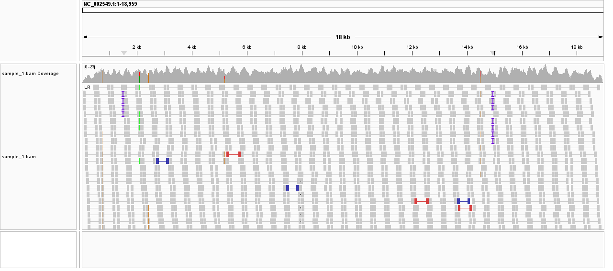
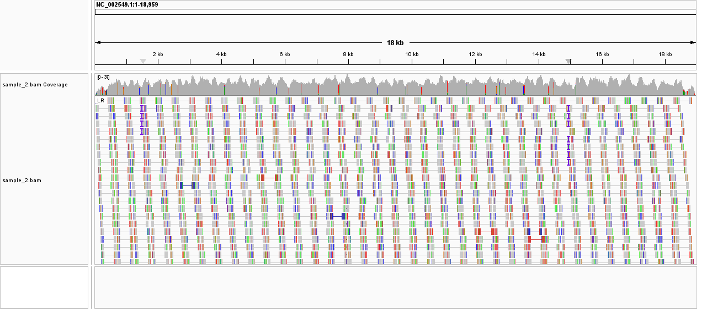
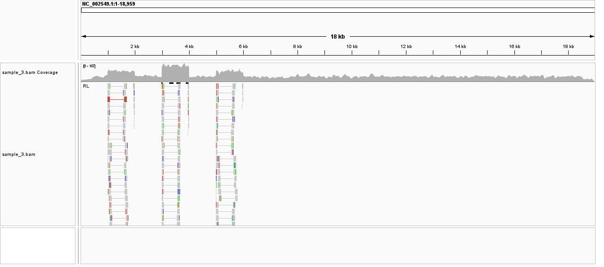
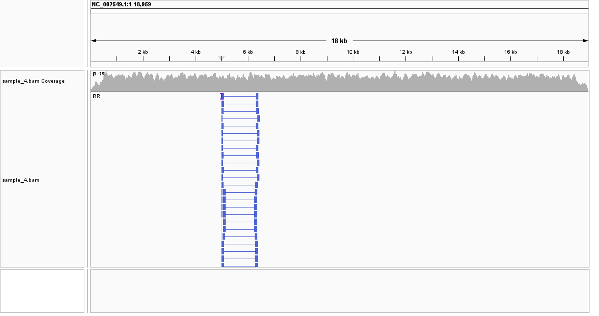
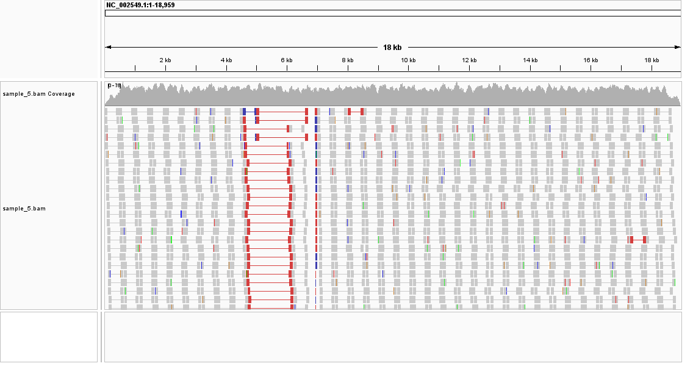

# Week 06: Evaluate Structural Variants in IGV

**Author:** Shraman Jana

**Reference genome:** *Zaire ebolavirus* (Ebola virus/H.sapiens-tc/COD/1976/Yambuku-Mayinga), NC_002549.1 (~18.96 kb)

Five paired-end samples were aligned to the 1976 Ebola reference. Each `BAM` was inspected visually in IGV to identify the type of structural variation (if any) relative to the reference. My descriptions below are based on the IGV signatures highlighted by the suggested settings - **View as pairs**, **Color by insert size**, **Color by strand**, and **Group by pair orientation**.

## How to load (IGV)

Reference: `Genomes -> Load Genome from URL`
- https://data.biostarhandbook.com/courses/2026-appbio/igv/fasta/ebola-1976.fa

Each sample: `File -> Load from URL` (leave the index path empty)
- https://data.biostarhandbook.com/courses/2026-appbio/igv/bam/sample_1.bam through `sample_5.bam`

---

## Sample 1 - No detectable variation (reference-like)

Sample 1 looks like a clean, concordant alignment with no sign of structural variations. Coverage is even across the whole genome, every read pair is in the normal forward-reverse (FR) orientation, and the insert sizes are tightly distributed around ~500 bp with no outliers. There are essentially no soft-clipped reads and no columns of shared mismatches. Turning on *color by insert size* and *group by pair orientation* produces a uniform, single-color field. My best interpretation is that this sample matches the reference and carries no large-scale variant (a negative control for comparison with the others).

## Sample 2 - Dense point mutations (SNVs / divergent sequence)

Sample 2 has the same even coverage, normal FR pairs, and ~500 bp insert sizes as Sample 1, so there is **no structural rearrangement**. What stands out important here instead is a dense scatter of **mismatched bases** distributed across the entire genome: almost every read carries several substitutions relative to the reference, and in IGV this appears as coloured mismatch tick-marks peppered along every read and in the coverage track, rather than being confined to one locus. Because the mismatches are genome-wide and the read pairs are perfectly concordant, my best interpretation is that this sample represents a **divergent strain with many single-nucleotide variants (SNPs/point mutations)**.

## Sample 3 - Duplication / copy-number gain

Sample 3 shows two linked signatures of a **tandem duplication (copy-number gain)**. First, the coverage is no longer uniform: several blocks in the first half of the genome (around ~1 kb, ~3 kb, and ~5 kb) rise to roughly two- to three-fold the baseline depth, exactly what is expected when a segment is present in extra copies. Second, *group by pair orientation* reveals a population of **away-facing (RF) read pairs** spanning the ~1-5.4 kb region that point outward. These pairs are the junction signatures of a tandem duplication. Together the elevated coverage and the RF pairs point to a duplication/copy-number gain in the ~1-5 kb region.

## Sample 4 - Inversion (~5.0-6.0 kb)

Sample 4's coverage stays flat across the whole genome (no gain or loss), but *group by pair orientation* / *color by strand* shows a cluster of **same-direction read pairs (FF/RR)** localised to roughly 4.5-6.4 kb, with two sharp breakpoints at about **5,000 and 6,000**. Unchanged coverage combined with same-direction pairs bracketed by two clean breakpoints is the example of an **inversion**: the ~1 kb segment between the breakpoints is flipped, so read pairs that straddle a breakpoint have one segment reverse-complemented and therefore point the same way. A subset of these pairs also shows an enlarged insert size when *color by insert size* is enabled.
So, my best interpretation is an **inversion of the ~5.0-6.0 kb segment**.

## Sample 5 - Deletion (~1 kb, around ~5.1-6.7 kb)

Sample 5 again shows normal FR orientation, but *color by insert size* lights up a distinct population of read pairs whose inserts are **~1,000 bp larger than normal** (~1,500 bp vs the ~500 bp baseline), all spanning the same window from roughly **5,100 to 6,750**. Read pairs that "stretch" across a region and land much farther apart on the reference than the library fragment size allows are the hallmarks of a **deletion**. The sample is missing a chunk of sequence, so segments that were close together in the fragment map to widely separated reference coordinates. So, my best interpretation is a **deletion of roughly 1 kb** within the ~5.1-6.7 kb region.

---

## Summary

| Sample | Best-guess variation | Key IGV evidence |
|--------|---------------------|------------------|
| 1 | None (reference-like) | Uniform coverage, all FR pairs, ~500 bp inserts |
| 2 | Dense SNPs / divergent strain | Genome-wide mismatched bases; pairs/coverage normal |
| 3 | Duplication (copy-number gain), ~1-5 kb | Elevated coverage blocks + away-facing (RF) pairs |
| 4 | Inversion, ~5.0-6.0 kb | Same-direction (FF/RR) pairs, two breakpoints, flat coverage |
| 5 | Deletion, ~1 kb near 5.1-6.7 kb | Read pairs with much larger insert size spanning the gap |
